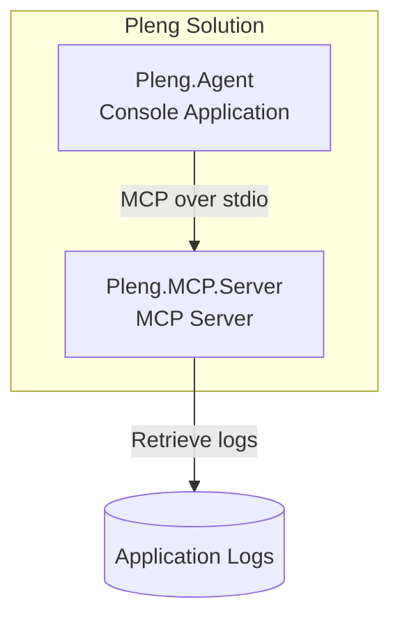
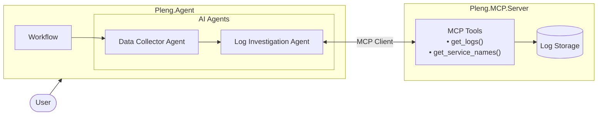
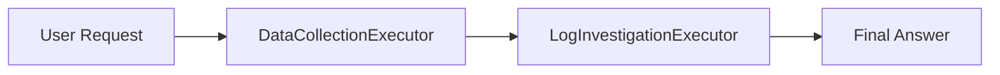
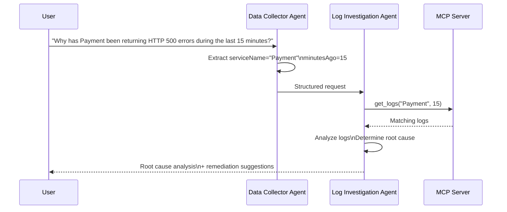

# Pleng: The Platform Engineering Agent

[](https://dotnet.microsoft.com/)
[](https://www.nuget.org/packages/Microsoft.Agents.AI/)
[](https://modelcontextprotocol.io/)

**Pleng** is a powerful, AI-driven log analysis agent built with the .NET Agent Framework. It acts as a virtual platform engineer, capable of understanding complex system failures and providing actionable insights by intelligently fetching and analyzing application logs.

Pleng combines a dual-agent workflow for data collection and investigation, and leverages the Model Context Protocol (MCP) to seamlessly integrate with a log server. It is designed to be modular, configurable, and offline-testable.  

The solution consists of two independent applications:

- Pleng.Agent — a console application that orchestrates multiple AI agents using a Workflow.
- Pleng.MCP.Server — an MCP server exposing tools for retrieving application logs



---

## 🚀 Features

*   **Dual-Agent Workflow**: Orchestrates two specialized agents using a workflow:
    1.  **Data Collector Agent**: Extracts structured data (service name, time range) from the user's natural language query.
    2.  **Log Investigator Agent**: Interacts with the MCP server, calls tools to fetch logs, and formulates a final, human-readable diagnosis.
*   **MCP-Powered Integration**: The `Log Investigator Agent` dynamically discovers and invokes tools from the `Pleng.MCP.Server` via the standardized MCP protocol.
*   **Instrumented Code**: The OpenAI chat client and also the agents are all instrumented and emit logs and metrics. sample traces showing the actual messages exchange between agent, mcp and LLM can be found in [sample-tarce-logs.txt](https://github.com/ShahryarSaljoughi/mcp-log-analysis-agent/blob/solution/ShahryarSaljoughi/solutions/csharp/ShahryarSaljoughi/sample-tarce-logs.txt)
*   **Configurable LLM Backend**: Easily switch between a real OpenAI-compatible LLM and a fully functional **Fake LLM** for testing and development without API costs.
*   **Offline Testability**: The fake backend and simulated logs allow you to run, test, and demonstrate the entire system without an internet connection or API keys.
*   **Extensible Design**: The agent, is separated from the LLM adapter using the `IChatClient` interface. Hence you can easily plug in other inference systems to this agent by implementing the `ChatClientProvider` abstraction. Clean separation of concerns makes it straightforward to add new log sources (collectors) or new MCP tools.
*   **Built on .NET 10**: Leverages the latest .NET features and performance improvements.

---


## 📁 Project Structure
The solution is organized to separate client and server.

```text
solutions/csharp/ShahryarSaljoughi/
├── Pleng.slnx                  # Solution file
├── README.md                  # This file
├── sample-tarce-logs.txt      # Sample execution trace
├── src/
│   ├── Pleng.Agent/           # The Agent console application
│   │   ├── Config.cs          # Configuration and backend enum
│   │   ├── Program.cs         # Entry point, workflow orchestration
│   │   ├── DataCollectorAgentCreator.cs # Builds the Data Collector Agent
│   │   ├── DataCollectionExecutor.cs   # Executor for the Data Collection step
│   │   ├── LogInvestigatorAgentCreator.cs # Builds the Log Investigator Agent
│   │   ├── LogInvestigationExecutor.cs   # Executor for the Log Investigation step
│   │   ├── LLMClients/        # Abstraction for LLM providers
│   │   │   ├── ChatClientProvider.cs
│   │   │   ├── OpenAIClientProvider.cs  # Real OpenAI client
│   │   │   └── FakeLLMClientProvider.cs # Fake client for testing
│   │   └── Properties/
│   │       └── launchSettings.json # Launch profiles for different backends
│   └── Pleng.MCP.Server/      # The MCP Server
│       ├── Program.cs         # Server entry point, registers tools
│       ├── Tools/             # MCP tools exposed to clients
│       │   ├── LogExplorerTools.cs    # Core log retrieval tools
│       │   └── RandomNumberTools.cs   # Example tool
│       └── Services/
│           ├── ILogStorageAdapter.cs # Abstraction for log data source
│           └── LogModel.cs           # Log data model
```
## Pleng.Agent

The agent is responsible for interacting with the user and orchestrating the investigation workflow.

It is implemented using Microsoft.Agents.AI.Workflows and consists of two collaborating agents.

### 1. Data Collector Agent

Responsibilities:

- Understand the user's natural-language request
- Extract required structured information
- Validate required inputs
- Produce structured JSON

Currently the workflow extracts:

- Service name
- Time range (`MinutesAgo`)

If any required information is missing, the workflow can terminate early without invoking any tools.

### 2. Log Investigation Agent

Responsibilities:

- Receive the structured information
- Use MCP tools to retrieve logs
- Analyze retrieved information
- Produce a platform-engineering style response
- Suggest possible root causes and remediation steps

Unlike the first agent, this agent has access to MCP tools.

## Pleng.MCP.Server

The MCP server exposes tools that can be discovered automatically by MCP clients.

Current tools include:

| Tool | Description|  
|----|----|
| get_logs | Retrieves logs for a given service since a specified number of minutes ago|  
| get_service_names | Returns the list of services that have available logs|  

The server is intentionally lightweight and only owns the execution of tools.

Business reasoning remains inside the agent.

----


## 🏗️ Architecture

The system is composed of two primary components, working in tandem:

1.  **`Pleng.Agent` (Client)**: The console application where the user interacts. It runs a workflow that uses two agents to process the user's query, decide on the necessary data, and interact with the MCP server.

2.  **`Pleng.MCP.Server` (Server)**: An MCP server that hosts and exposes tools (e.g., `get_logs`, `get_service_names`) for the agent to invoke.





**Step-by-step interaction:**

1. **User Input:** The user asks a question, e.g., "Why has the hub been returning HTTP 500 errors during the last 15 minutes?".
2. **Data Collection:** The `Data Collector Agent` processes the query and outputs structured data (e.g., `{serviceName: "hub", minutesAgo: 15}`).
3. **Investigation:** The `Log Investigator Agent` uses this structured data to call the MCP server's `get_logs` tool. If the service name is invalid (as with "hub"), it intelligently calls `get_service_names` to find the correct service (`CommunicationsHub`) and retries the request.
4. **Result Synthesis:** After obtaining the logs (even if empty), the `Log Investigator Agent` uses the LLM to generate a final answer, starting with the relevant logs and followed by hints on how to resolve the issue.
5. **Output:** The final diagnosis is printed to the console.

----




---

## 🛠️ Getting Started

### Prerequisites

- [.NET 10 SDK](https://dotnet.microsoft.com/en-us/download/dotnet/10.0)
- (Optional) An OpenAI-compatible API key and endpoint (e.g., from OpenAI or [AvvalAI](https://avvalai.ir)).

### 1. Clone the Repository
```bash
git clone <your-repository-url>
cd solutions/csharp/ShahryarSaljoughi
```
### 2. Run the Application
You can run Pleng in two modes: Fake (for testing) and OpenAI.

#### Option A: Run with Fake LLM (No API Key Required)
This mode uses a simulated LLM and pre-defined logs, perfect for a quick demo or testing.

```bash
dotnet run --project .\src\Pleng.Agent\ -lp Pleng.Agent-Fake -- "Why has the payment service been returning HTTP 500 errors during the last 15 minutes?"
```
#### Option B: Run with OpenAI LLM
This mode uses a real OpenAI-compatible LLM for intelligent analysis. The API key is provided through launchSettings.json. You can also set the environment variables manually (`OPENAI_API_KEY`, `OPENAI_ENDPOINT`, `BackendType`).

Before running, ensure your launchSettings.json or environment variables are correctly configured.

```bash
dotnet run --project .\src\Pleng.Agent\ -lp Pleng.Agent-OpenAI -- "Why has the hub been returning HTTP 500 errors during the last 15 minutes?"
```
  

## 🔧 Configuration
All configuration for the Agent is managed via environment variables, making it suitable for containerized deployments.

| Variable Name | Description |	Required? |  
|----|----|----|  
| BackendType | The LLM backend to use. Valid values are OpenAI or Fake. | Yes |  
| OPENAI_API_KEY | The API key for your OpenAI-compatible endpoint. Only required for OpenAI backend. | No |  
| OPENAI_ENDPOINT | The endpoint URL for your OpenAI-compatible API. Only required for OpenAI backend. | No |  
| OPENAI_MODEL | (Optional) The model to use (defaults to gpt-5-mini). | No |  

## 🧪 Examples
### Example 1: Querying a Known Service
Command:

```bash
dotnet run --project .\src\Pleng.Agent\ -lp Pleng.Agent-OpenAI -- "Why has the payment service been returning HTTP 500 errors during the last 15 minutes?"
```
Output:

```text
Relevant logs: "[Error] - Payment - Database Connection Timedout after ms on SQL-Server-01"

This indicates the payment service is failing to open/obtain DB connections to SQL-Server-01 (causing 500s); likely causes are the DB being overloaded/unreachable, exhausted connection pool on the service, network/firewall or auth issues, or long-running/blocked queries on the server. Immediate steps: check SQL-Server-01 health (CPU, memory, active connections, locks/blocked queries and its error logs) and network connectivity from payment hosts...
```
### Example 2: Querying an Unknown Service (Intelligent Correction)

Command:

```bash
dotnet run --project .\src\Pleng.Agent\ -lp Pleng.Agent-OpenAI -- "Why has the hub been returning HTTP 500 errors during the last 15 minutes?"
```
Output:

```text
Relevant logs: fetching logs for service name 'hub' failed (Service name is not valid). Available services are: Payment, Loan, CommunicationsHub — a logs pull for CommunicationsHub over the last 15 minutes returned no entries. Hints to fix: confirm the exact service name used by clients (the system has no plain "hub" — it may be CommunicationsHub), then check the ingress/load‑balancer and API‑gateway/nginx logs...
```


